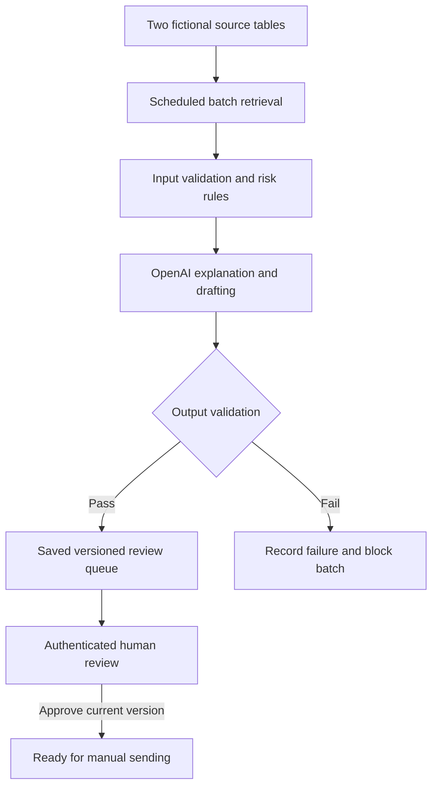
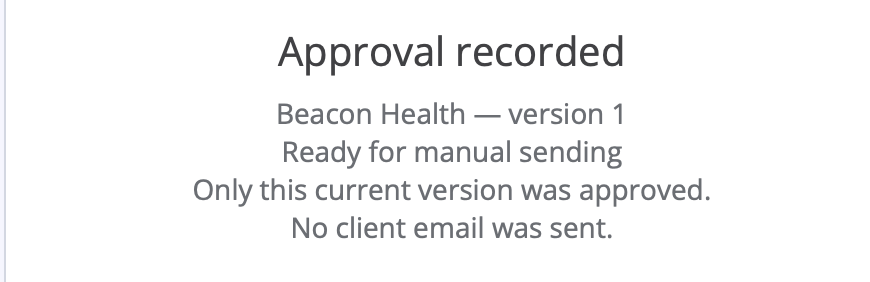

# AI client review and human approval

A working **n8n / OpenAI portfolio prototype** for reviewing 34 fictional client accounts, drafting outreach and preserving human approval before manual sending.

**Demonstrated:** 34 saved account results, 24 drafted items, a current-version approval for C002, and an actual validation failure followed by controlled recovery. **No client email was sent.**

[Two-page project overview](docs/Client_Review_Portfolio.pdf) · [中文讲解](docs/Demo_Guide_CN.md) · [View the fictional data](data/Client_Review_34_Fictional_Data.xlsx) · [Evidence and limitations](docs/EVIDENCE.md)

## The problem

A recurring client review involves gathering account facts, identifying concerns, writing personalised messages and asking a lead to review them. This prototype automates retrieval and draft preparation while preserving a person's judgment about facts, tone, relationship context and suitability.

## Workflow

The diagram describes the latest template. Earlier recorded executions used earlier configurations; the evidence is not presented as one unchanged run.

| Element | Implementation |
| --- | --- |
| Trigger | A two-minute schedule for the demonstration, with up to eight accounts per model call |
| Inputs | Setup execution 93 wrote embedded fictional JSON into two n8n Data Tables; subsequent runs retrieved the records automatically |
| Rules and AI | The latest FIX03 template computes fixed risk decisions in code; the model explains the supplied decision and drafts text |
| Destination | Persistent review queue with source snapshots, versions and model provenance, plus a separate audit table |
| Human checkpoint | A signed-in reviewer reads the saved draft and source facts and records a decision for that version |
| Sending | Not connected; approval marks the draft ready for manual sending |

There was **no manual CSV import and no live CRM connection**. The CSV and Excel files here are later viewing exports of the same fictional fixture.

## Results and an example

| Saved category | Accounts | Output |
| --- | ---: | --- |
| Green | 10 | No outreach draft |
| Amber | 12 | Personalised check-in email |
| Red | 8 | Internal issue, action, owner and manager plan |
| Review Pending | 4 | Internal request for missing or stale health information |

For **C002 / Beacon Health**, the source facts included two interactions, health score 3, an outstanding export-column request and renewal on 15 October 2026. The saved email referred to the reporting portal release and asked how it fitted the client's weekly routine. The review form subsequently confirmed approval of version 1, reference `GEN-98-C002-V1`.

The paired source screenshots supported this version-specific approval. The displayed-version screenshot is retained in the private source archive because it includes an unrelated desktop notification; it is not included here. The raw approval-node audit JSON and approval execution ID were not collected.

## What went wrong and what changed

An earlier model response treated a health update on the first day of the assessment month as stale. Another classified a 14-day contact gap as Green even though the rubric required Amber.

In **execution 238**, validation rejected that second error, audit row 37 recorded `RUN_FAILED`, and eight claimed rows became `Processing failed / Not ready`. A later recovery saved the affected accounts in execution 270. The original failure-handling implementation had also needed a correction to associate failures with the right run; the evaluation notes preserve that history.

**Design decision:** move explicit threshold calculations into code and use the model for explanation and drafting. Matching a label supplied by code is not an independent test of model classification accuracy.

## Explore the project

| File or folder | Purpose |
| --- | --- |
| [01_Setup_34_Accounts.json](01_Setup_34_Accounts.json) | Seed the fictional CRM, delivery, review queue and audit tables |
| [02_Scheduled_Processing.json](02_Scheduled_Processing.json) | Scheduled retrieval, validation, drafting, storage and failure handling |
| [03_Human_Review.json](03_Human_Review.json) | Authenticated review of a saved version |
| [portfolio_core.mjs](portfolio_core.mjs) | Supporting JavaScript logic |
| [classification_rubric.txt](classification_rubric.txt) | Explicit demonstration rules |
| [demo_fixture.json](demo_fixture.json) | Original fictional inputs and expected scenarios |
| [check_local.mjs](check_local.mjs) | Local logic checks using fixtures and mocked responses |
| [evidence/](evidence/) | Selected saved outputs, failure records and screenshots |
| [docs/SETUP.md](docs/SETUP.md) | Setup requirements and instructions |

## Scope and limits

- These are configuration templates and patches, not a fresh export of every deployed cloud setting. Credentials and workspace-specific references are omitted.
- The saved results span executions 98, 234, 270, 272 and 276 and multiple configuration versions.
- The full queue snapshot precedes C002 approval; its 34 awaiting-review statuses are historical, not the latest live state.
- Return, feedback-driven revision and stale-form rejection were not demonstrated. Other failure types, including network timeouts, remain untested.
- Live CRM integration, last-working-day scheduling, client delivery and measured business time savings are outside scope.
- This is a portfolio prototype using synthetic inputs, not a production deployment or a claim of 100% AI accuracy.

## Contribution

**Fujia Yang:** configured and ran the workflows, inspected outputs and failure evidence, and made the demonstrated review decision. ChatGPT assisted with design, fictional cases, code, debugging and documentation.
